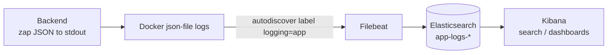
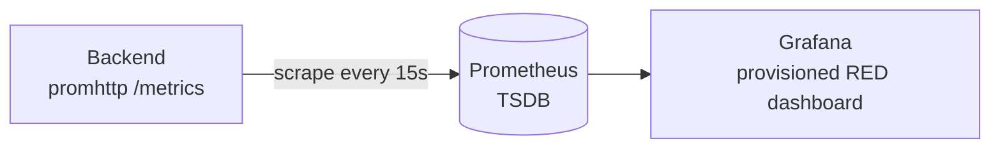
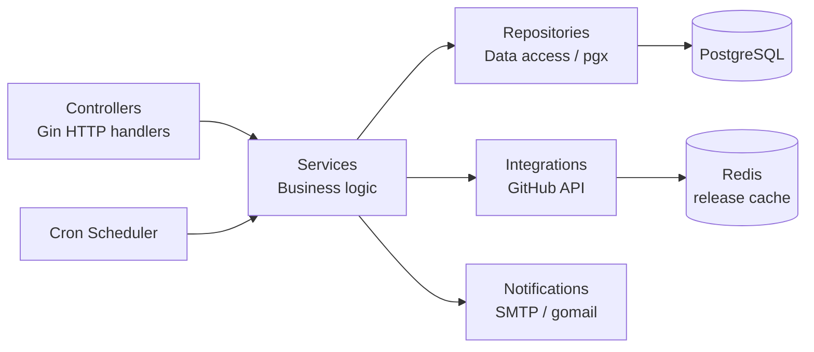

# GitHub Release Notification API

## Project Overview

A Go REST API that lets users subscribe to email notifications about new releases of any public GitHub repository. 
When a tracked repository publishes a new release, every confirmed subscriber receives an email with the update details.

The app is hosted at AWS: [frontend](http://51.20.10.168:4173/),
[backend](http://51.20.10.168:8080/swagger/index.html#/),
(api key is `test-api-key`).

**Core workflow:**

1. A user subscribes by providing their email and a GitHub repository (`owner/repo`).
2. The system validates the repository via the GitHub API and sends a confirmation email with a unique token.
3. The user confirms the subscription by following the link in the email.
4. A cron job periodically polls the GitHub API for new releases (responses are cached in Redis to cut API calls and respect rate limits); when a new tag is detected, all confirmed subscribers are notified via email.
5. Users can unsubscribe at any time using a token included in every notification email.

**Key technologies:**

| Concern | Technology |
|---|---|
| Language | Go 1.26 |
| HTTP framework | [Gin](https://github.com/gin-gonic/gin) |
| Database driver | [pgx v5](https://github.com/jackc/pgx) + [pgxpool](https://pkg.go.dev/github.com/jackc/pgx/v5/pgxpool) on PostgreSQL 16 |
| Cache / NoSQL store | [redis/go-redis v9](https://github.com/redis/go-redis) on Redis 7 (caches GitHub release lookups) |
| Schema migrations | [golang-migrate](https://github.com/golang-migrate/migrate) (embedded SQL, run on startup) |
| GitHub client | [go-github v84](https://github.com/google/go-github) |
| Email delivery | SMTP via [gomail](https://github.com/go-gomail/gomail) |
| Cron scheduler | [robfig/cron](https://github.com/robfig/cron) |
| Configuration | [Viper](https://github.com/spf13/viper) + [godotenv](https://github.com/joho/godotenv) |
| Logging | [zap](https://go.uber.org/zap) (structured JSON, shipped via Filebeat → Elasticsearch → Kibana) |
| Metrics | [Prometheus client_golang](https://github.com/prometheus/client_golang) + Grafana (RED dashboard) |
| API docs | [Swagger / swag](https://github.com/swaggo/swag) |
| Linting | [golangci-lint](https://golangci-lint.run) |
| Git hooks | [Lefthook](https://github.com/evilmartians/lefthook) |
| Containerisation | Docker multi-stage build + Docker Compose |

---

## How to Run

### Prerequisites

- **Go ≥ 1.26**
- **PostgreSQL 16** (or use the Docker Compose setup)
- **Redis 7** (or use the Docker Compose setup)
- **Docker & Docker Compose** (for the containerised path)
- A **GitHub personal access token** (classic, with `public_repo` scope is enough)
- SMTP credentials for sending emails (e.g. Gmail App Password, Mailtrap, etc.)

### Environment variables

Copy the example file and fill in real values:

```bash
cp .env.example .env
```

**Backend (read by the Go app):**

| Variable | Description |
|---|---|
| `DB_DSN` | PostgreSQL connection string |
| `SERVER_PORT` | HTTP port the server listens on (default `8080`) |
| `SERVER_API_KEY` | Static API key for the `X-API-Key` header (leave empty to disable auth) |
| `GITHUB_TOKEN` | GitHub personal access token |
| `MAILER_HOST` | SMTP host |
| `MAILER_PORT` | SMTP port (e.g. `587`) |
| `MAILER_USERNAME` | SMTP username |
| `MAILER_FROM` | Sender email address |
| `MAILER_SMTP` | SMTP server address |
| `MAILER_PASSWORD` | SMTP password |
| `REDIS_ADDRESS` | Redis `host:port` for the GitHub release cache (default `redis:6379`) |
| `REDIS_PASSWORD` | Redis password (leave empty if unset) |
| `REDIS_DB` | Redis logical database number (default `0`) |
| `CRON_REPO_CHECK_SCHEDULE` | Cron expression for release polling (default `0 * * * *` — every hour) |
| `FRONTEND_URL` | Base URL used to build confirmation / unsubscribe links in emails |

> The `LOG_*` variables are documented under [Structured Logging & Log Pipeline → Configuration](#configuration).

**Postgres container (used only by Docker Compose to initialise the database — the app itself connects via `DB_DSN`):**

| Variable | Description |
|---|---|
| `POSTGRES_USER` | Superuser created when the postgres container first starts |
| `POSTGRES_PASSWORD` | Superuser password |
| `POSTGRES_DB` | Database name created on first start |

### Run locally

```bash
# 1. Install dependencies
make dependencies        # runs go mod tidy && go mod download

# 2. Make sure PostgreSQL and Redis are running, and that DB_DSN and
#    REDIS_ADDRESS in .env point to them

# 3. Start the server
go run cmd/main.go
```

The server starts on the port defined by `SERVER_PORT` (default `8080`).
Swagger UI is available at `http://localhost:8080/swagger/index.html`.

### Run with Docker Compose

```bash
# Build and start both the backend and PostgreSQL containers
docker compose up --build
```

This will:
- Start a **PostgreSQL 16** container with a health-check.
- Build the Go binary inside a multi-stage Docker image and start the **backend** container.
- Expose the API on the port specified by `SERVER_PORT` in your `.env`.

To stop:

```bash
docker compose down
```

### Useful Makefile targets

| Target | Description |
|---|---|
| `make dependencies` | `go mod tidy` + `go mod download` |
| `make lint` | Run `golangci-lint` (auto-installs if missing) |
| `make swagger` | Regenerate Swagger docs from annotations into `docs/generated/` |
| `make test-unit` | Run unit tests with the race detector (`go test -race ./internal/...`) |
| `make test-integration` | Spin up `docker-compose.test.yml` (Postgres + Redis + runner) and run the integration suite (`make test-integration-down` to clean up) |
| `make test-e2e` | Spin up `docker-compose.e2e.yml` (full stack + frontend + Mailpit) and run the end-to-end suite (`make test-e2e-down` to clean up) |
| `make up` | Start the whole stack: backend + Postgres + Redis + logging (ES/Kibana/Filebeat) + metrics (Prometheus/Grafana) |
| `make down` | Stop the stack (append `-v` manually to also drop the ES/TSDB/db volumes) |
| `make logs` | Follow logs (`make logs SVC="prometheus grafana"` to scope) |

### Git hooks (Lefthook)

Pre-commit hooks run **linting** and **Swagger docs regeneration** in parallel. Install with:

```bash
go run github.com/evilmartians/lefthook/v2 install
```

---

## Structured Logging & Log Pipeline (Elasticsearch + Kibana)

The service emits **structured JSON logs** (via [zap](https://go.uber.org/zap)) and ships
them through a local **Filebeat → Elasticsearch → Kibana** pipeline for search and
aggregation.

> ⚠️ This stack is for **local development** only. A production Elasticsearch
> cluster should be provisioned through your DevOps/IT team.

### How it works



- The app writes one JSON object per line to **stdout** using
  [ECS](https://www.elastic.co/guide/en/ecs/current/index.html)-friendly field names
  (`@timestamp`, `log.level`, `message`, `service.name`, `http.request.method`, …).
- Every HTTP request is tagged with a correlation **`request_id`** (returned in the
  `X-Request-ID` response header and reusable on the way in) so related log lines can be
  traced together.
- Docker captures stdout via the `json-file` driver. **Filebeat** autodiscovers only the
  container labelled `logging: "app"`, decodes the JSON, and ships it to Elasticsearch
  under daily indices `app-logs-YYYY.MM.dd`.
- **Kibana** queries those indices for ad-hoc search (Discover) and dashboards.

### Configuration

| Variable | Default | Description |
|---|---|---|
| `LOG_LEVEL` | `info` | `debug` / `info` / `warn` / `error` |
| `LOG_ENCODING` | `json` | `json` for the pipeline, `console` for human-readable local dev |
| `LOG_ENVIRONMENT` | `development` | Tags every log with `service.environment` |
| `LOG_SERVICE_NAME` | `se-school` | Tags every log with `service.name` |
| `LOG_VERSION` | `dev` | Tags every log with `service.version` |

### Run the pipeline

```bash
# Brings up the whole stack (backend + postgres + redis + ES/Kibana/Filebeat + Prometheus/Grafana)
make up

# Follow the logging components (optional)
make logs SVC="filebeat elasticsearch kibana"
```

Endpoints once it's up:

- Backend / Swagger: `http://localhost:8080/swagger/index.html`
- Elasticsearch: `http://localhost:9200`
- Kibana: `http://localhost:5601`

Generate some traffic so there are logs to look at:

```bash
curl -H "X-API-Key: $SERVER_API_KEY" "http://localhost:8080/api/subscriptions?email=test@example.com"
curl "http://localhost:8080/swagger/index.html"
```

Confirm logs reached Elasticsearch:

```bash
curl "http://localhost:9200/_cat/indices/app-logs-*?v"
curl "http://localhost:9200/app-logs-*/_search?size=1&pretty"
```

### Set up Kibana (one-time, manual)

1. Open **http://localhost:5601**.
2. Go to **Stack Management → Data Views → Create data view**.
   - **Name**: `app-logs`
   - **Index pattern**: `app-logs-*`
   - **Timestamp field**: `@timestamp`
   - Save.
3. Open **Discover**, pick the `app-logs-*` data view, and explore. Useful
   [KQL](https://www.elastic.co/guide/en/kibana/current/kuery-query.html) filters:
   - `log.level: "error"` — only errors
   - `http.response.status_code >= 400` — failing requests
   - `request_id: "<id>"` — every line for one request (copy the `X-Request-ID` header)
   - `service.name: "se-school" and message: "http request"` — access log
4. Build visualizations (**Dashboard → Create → Create visualization**), e.g.:
   - **Log volume by level**: a bar chart over `@timestamp` split by `log.level`.
   - **Top errors**: a data table of `message` filtered to `log.level: "error"`.
   - **Request latency**: average/percentile of `event.duration` (milliseconds) over time.
   - **Slowest endpoints**: `event.duration` aggregated by `url.path`.
   Save them to a dashboard.

### Tear down

```bash
make down          # keep volumes
# or, to also delete indexed logs / metrics / db data:
docker compose down -v
```

> On Linux, Elasticsearch may require a higher `vm.max_map_count`:
> `sudo sysctl -w vm.max_map_count=262144`. Docker Desktop (macOS/Windows) handles this
> automatically.

---

## Metrics & RED Pipeline (Prometheus + Grafana)

The service is instrumented with **[RED](https://grafana.com/blog/2018/08/02/the-red-method-how-to-instrument-your-services/)
metrics** (Rate, Errors, Duration) exposed in Prometheus format at **`/metrics`**, and ships
them through a local **Prometheus → Grafana** pipeline for scraping and visualization.

> ⚠️ This stack is for **local development** only. Production Prometheus/Grafana should be
> provisioned through your DevOps/IT team.

### How it works



- An HTTP middleware (`PrometheusMiddleware`) records every request; the **cron worker** records
  each run and per-repository check. Metrics live under the `se_school` namespace
  (`internal/metrics/metrics.go`).
- **Prometheus** scrapes the backend's `/metrics` endpoint (config: `deploy/metrics/prometheus.yml`).
- **Grafana** auto-provisions the Prometheus datasource and a **RED dashboard**
  (`deploy/metrics/grafana/`) — no manual setup needed.

### What's measured

| Signal | HTTP | Cron worker |
|---|---|---|
| **Rate** | `se_school_http_requests_total` | `se_school_cron_job_runs_total`, `se_school_repo_check_total` |
| **Errors** | same, by `status` label (`4xx`/`5xx`) | same, by `status` label (`success`/`error`) |
| **Duration** | `se_school_http_request_duration_seconds` | `se_school_cron_job_duration_seconds` |

`se_school_http_requests_in_flight` (gauge) additionally tracks concurrent requests.

### Run the pipeline

```bash
# Same single stack — metrics come up with everything else
make up

# Follow the metrics components (optional)
make logs SVC="prometheus grafana"
```

Endpoints once it's up:

- Backend / raw metrics: `http://localhost:8080/metrics`
- Prometheus: `http://localhost:9090` (check **Status → Targets**: `se-school` should be `UP`)
- Grafana: `http://localhost:3000` (login `admin` / `admin`; anonymous viewing is enabled)

Generate some traffic, then confirm the series exist:

```bash
curl "http://localhost:8080/swagger/index.html"
curl -s "http://localhost:8080/metrics" | grep se_school_
```

Open Grafana → the **se-school RED** dashboard for rate / error / latency panels (HTTP + cron).

### Tear down

```bash
make down          # keep volumes
# or, to also delete stored metrics / logs / db data:
docker compose down -v
```

---

## Testing

The project has three test tiers:

| Tier | Location | Runs against | Command |
|---|---|---|---|
| **Unit** | `internal/**/*_test.go` | Pure Go, mocked dependencies | `make test-unit` |
| **Integration** | `tests/integration/` | Ephemeral Postgres + Redis, GitHub API mocked in-process | `make test-integration` |
| **End-to-end** | `tests/e2e/` | Full stack via Docker Compose: backend, frontend, Postgres, Redis, [Mailpit](https://github.com/axllent/mailpit) | `make test-e2e` |

- **Unit** tests run with the race detector across `./internal/...`.
- **Integration** tests (`docker-compose.test.yml`) boot throwaway `postgres:16.3` and
  `redis:7` containers (tmpfs, no volumes) plus a test runner (`Dockerfile.test`, env from
  `.env.test`). The GitHub API is stubbed by a local mock (`tests/integration/helpers/mswgh.go`);
  shared bootstrap and fixtures live in `tests/integration/helpers/`.
- **End-to-end** tests (`docker-compose.e2e.yml`, env from a local `.env.e2e`) bring up the
  real backend, the Vite frontend, Postgres, Redis, and Mailpit, then drive the full flow
  (subscribe → confirm → list → unsubscribe) and assert captured emails via Mailpit. The
  release-check cron is parked on a far-future schedule so it doesn't fire mid-run. This suite
  is its own Go module (`tests/e2e/go.mod`).

The `*-down` targets (`make test-integration-down`, `make test-e2e-down`) tear down the
corresponding stack and drop its volumes.

---

## Project Structure

```
.
├── cmd/
│   └── main.go                          # Application entry-point
├── docs/
│   ├── adrs/                            # Architecture decision records
│   ├── source-swagger.yaml              # Hand-written OpenAPI 2.0 spec
│   └── generated/                       # Auto-generated Swagger files (swag init)
├── internal/
│   ├── config/                          # Configuration structs & .env loader (Viper)
│   ├── controllers/                     # HTTP handlers (Gin) & route registration
│   │   ├── middlewares/                 # CORS, API-key, error-handling & structured-logging middlewares
│   │   ├── router.go                   # Route definitions
│   │   └── subscription.go             # Subscription endpoint handlers
│   ├── cron/                            # Cron scheduler (robfig/cron)
│   ├── infrastructure/
│   │   ├── db/                          # pgxpool connection + embedded golang-migrate migrations
│   │   ├── logging/                     # Structured zap logger + request-scoped context helpers
│   │   └── redis/                       # Redis client connection
│   ├── integrations/
│   │   └── github/                      # GitHub API client (go-github), Redis-cached
│   ├── metrics/                         # Prometheus RED metric definitions (metrics.go)
│   ├── models/                          # Domain models & DTOs
│   │   ├── subscription.go             # Subscription model
│   │   ├── repository.go               # Repository model
│   │   ├── code.go                     # Confirmation / unsubscribe code model
│   │   ├── factories/                  # Confirmation / unsubscribe code factories
│   │   └── dto/                        # Request / response DTOs
│   ├── notifications/                   # Email notification orchestration
│   │   ├── mailer/                     # Low-level SMTP sending (gomail)
│   │   └── templates/                  # HTML email templates & rendering
│   │       └── htmls/                  # Raw HTML template files
│   ├── repositories/                    # Data-access layer (pgx queries)
│   │   ├── code/                       # Code repository
│   │   ├── repository/                 # Repository repository
│   │   └── subscription/               # Subscription repository
│   ├── services/                        # Business logic layer
│   │   ├── repository/                 # Release-check & notification dispatch
│   │   └── subscription/               # Subscribe / confirm / unsubscribe / list
│   └── utils/                           # Shared helpers (e.g. code generation)
├── tests/
│   ├── integration/                     # Integration tests (Postgres + Redis, GitHub mocked)
│   │   └── helpers/                     # Suite bootstrap, fixtures, GitHub mock
│   └── e2e/                             # End-to-end tests (full stack + frontend + Mailpit)
│       └── helpers/                     # Suite bootstrap, flows, Mailpit client
├── deploy/
│   ├── logging/
│   │   └── filebeat.yml                 # Filebeat autodiscover + Elasticsearch output config
│   └── metrics/
│       ├── prometheus.yml               # Prometheus scrape config (backend /metrics)
│       └── grafana/                     # Provisioned datasource + RED dashboard
├── .env.example                         # Environment variable template
├── .golangci.yml                        # Linter configuration
├── docker-compose.yml                   # Full local stack: app + logging + metrics
├── docker-compose.test.yml              # Integration-test stack (Postgres + Redis + runner)
├── docker-compose.e2e.yml               # End-to-end stack (app + frontend + Mailpit)
├── Dockerfile                           # Multi-stage Docker build (app)
├── Dockerfile.test                      # Integration-test runner image
├── lefthook.yml                         # Git hook definitions
├── Makefile                             # Build / lint / swagger / test targets
├── go.mod / go.sum                      # Go module files
└── README.md
```

The codebase follows a **layered architecture**:



Every layer communicates through **Go interfaces**, making it straightforward to mock dependencies in tests.

---

## API Overview

All endpoints are served under the `/api` base path and require the `X-API-Key` header (unless `SERVER_API_KEY` is left empty).

Interactive Swagger UI is available at **`/swagger/index.html`** when the server is running.

## Future improvements

1. Switch to an external notifications provider (currently SMTP via gomail).
2. Wire the unit / integration / e2e suites into CI to run on every push.