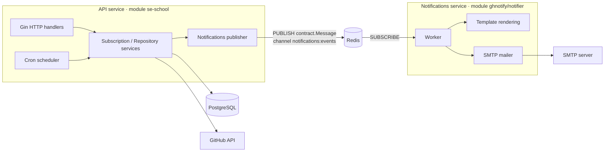
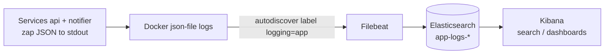
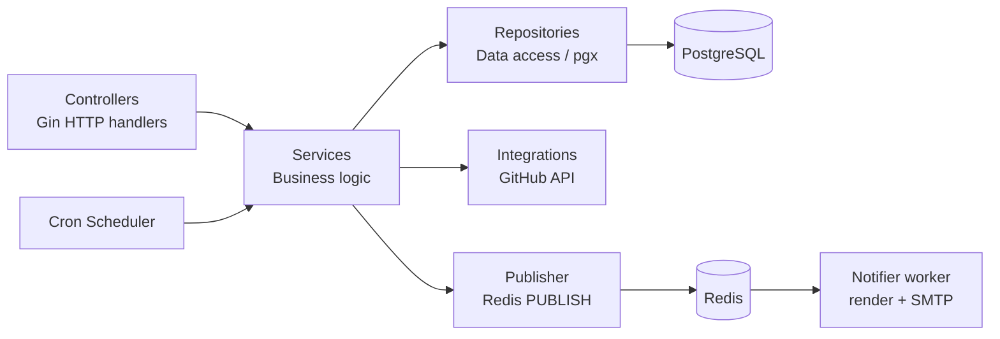

# GitHub Release Notification API

## Project Overview

A Go REST API that lets users subscribe to email notifications about new releases of any public GitHub repository. 
When a tracked repository publishes a new release, every confirmed subscriber receives an email with the update details.

The app is hosted at AWS: [frontend](http://51.20.10.168:4173/),
[backend](http://51.20.10.168:8080/swagger/index.html#/),
(api key is `test-api-key`).

**Core workflow:**

1. A user subscribes by providing their email and a GitHub repository (`owner/repo`).
2. The system validates the repository via the GitHub API and sends a confirmation email with a unique token.
3. The user confirms the subscription by following the link in the email.
4. A cron job periodically polls the GitHub API for new releases; when a new tag is detected, all confirmed subscribers are notified via email.
5. Users can unsubscribe at any time using a token included in every notification email.

---

## Architecture

The system is split into **two independently deployable microservices** plus a shared
contract module. Email delivery — the notifications domain — has been extracted out of the
API into its own service. The two communicate asynchronously over a **Redis Pub/Sub** channel;
they share no database and make no in-process calls, only the wire types in `pkg/contract`.



- **API service** (`services/api`, Go module `se-school`): the HTTP API, the release-check
  cron, the database and the GitHub integration. When it needs to send an email it **publishes**
  a `contract.Message` (template name + receivers + payload) to Redis instead of sending it.
- **Notifications service** (`services/notifications`, Go module `ghnotify/notifier`):
  subscribes to the channel, renders the HTML template (embedded in the binary) and delivers the
  email over SMTP. It owns no database and no domain logic.
- **Contract** (`pkg/contract`, Go module `ghnotify/contract`): the pure, JSON-serializable
  types both sides agree on (the channel name, template names and payloads).

> **Delivery semantics:** Pub/Sub is fire-and-forget (at-most-once) — if the notifier is down
> when a message is published, that message is lost. The wire contract is identical to a Redis
> Streams setup, so upgrading to durable, acknowledged delivery later is a localized change.

**Key technologies:**

| Concern | Technology |
|---|---|
| Language | Go 1.26 |
| HTTP framework | [Gin](https://github.com/gin-gonic/gin) |
| Database driver | [pgx v5](https://github.com/jackc/pgx) + [pgxpool](https://pkg.go.dev/github.com/jackc/pgx/v5/pgxpool) on PostgreSQL 16 |
| Schema migrations | [golang-migrate](https://github.com/golang-migrate/migrate) (embedded SQL, run on startup) |
| GitHub client | [go-github v84](https://github.com/google/go-github) |
| Email delivery | SMTP via [gomail](https://github.com/go-gomail/gomail) (in the notifications service) |
| Inter-service messaging | Redis Pub/Sub via [go-redis v9](https://github.com/redis/go-redis) |
| Cron scheduler | [robfig/cron](https://github.com/robfig/cron) |
| Configuration | [Viper](https://github.com/spf13/viper) + [godotenv](https://github.com/joho/godotenv) |
| Logging | [zap](https://go.uber.org/zap) |
| API docs | [Swagger / swag](https://github.com/swaggo/swag) |
| Linting | [golangci-lint](https://golangci-lint.run) |
| Git hooks | [Lefthook](https://github.com/evilmartians/lefthook) |
| Containerisation | Docker multi-stage build + Docker Compose |

---

## How to Run

### Prerequisites

- **Go ≥ 1.26**
- **PostgreSQL 16** (or use the Docker Compose setup)
- **Docker & Docker Compose** (for the containerised path)
- A **GitHub personal access token** (classic, with `public_repo` scope is enough)
- SMTP credentials for sending emails (e.g. Gmail App Password, Mailtrap, etc.)

### Environment variables

Copy the example file and fill in real values:

```bash
cp .env.example .env
```

| Variable | Description |
|---|---|
| `DB_DSN` | PostgreSQL connection string |
| `SERVER_PORT` | HTTP port the server listens on (default `8080`) |
| `SERVER_API_KEY` | Static API key for the `X-API-Key` header (leave empty to disable auth) |
| `GITHUB_TOKEN` | GitHub personal access token |
| `MAILER_HOST` | SMTP host |
| `MAILER_PORT` | SMTP port (e.g. `587`) |
| `MAILER_USERNAME` | SMTP username |
| `MAILER_FROM` | Sender email address |
| `MAILER_SMTP` | SMTP server address |
| `MAILER_PASSWORD` | SMTP password |
| `CRON_REPO_CHECK_SCHEDULE` | Cron expression for release polling (default `0 * * * *` — every hour) |
| `POSTGRES_USER` | Postgres user (used by the Docker Compose postgres container) |
| `POSTGRES_PASSWORD` | Postgres password |
| `POSTGRES_DB` | Postgres database name |

### Run locally

The two services are separate Go modules. Each runs from its own module directory; both need a
running Redis (the API publishes to it, the notifier subscribes).

```bash
# 1. Install dependencies for every module
make dependencies        # go mod tidy && go mod download per module

# 2. Make sure PostgreSQL and Redis are running and .env points to them

# 3. Start the API (HTTP + cron + publisher)
cd services/api && go run ./cmd

# 4. In another terminal, start the notifications service (consumer + SMTP)
cd services/notifications && go run ./cmd
```

The API starts on the port defined by `SERVER_PORT` (default `8080`).
Swagger UI is available at `http://localhost:8080/swagger/index.html`.

### Run with Docker Compose

A single compose file brings up the whole cluster:

```bash
# Build and start redis + postgres + api + notifier
docker compose up --build
```

This will:
- Start **Redis 7** and **PostgreSQL 16** containers with health-checks.
- Build and start the **api** service (HTTP API + cron), exposed on `SERVER_PORT`.
- Build and start the **notifier** service (Redis consumer + SMTP sender).

To stop:

```bash
docker compose down
```

### Useful Makefile targets

| Target | Description |
|---|---|
| `make dependencies` | `go mod tidy` + `go mod download` for every module |
| `make lint` | Run `golangci-lint` per module (auto-installs if missing) |
| `make swagger` | Regenerate Swagger docs into `services/api/docs/generated/` |
| `make test-unit` | Run unit tests across all modules |
| `make logging-up` | Start the app together with the Elasticsearch + Kibana + Filebeat stack |
| `make logging-down` | Stop the logging stack (append `-v` manually to also drop the ES volume) |
| `make logging-logs` | Follow the logs of Filebeat / Elasticsearch / Kibana |

### Git hooks (Lefthook)

Pre-commit hooks run **linting** and **Swagger docs regeneration** in parallel. Install with:

```bash
go run github.com/evilmartians/lefthook/v2 install
```

---

## Structured Logging & Log Pipeline (Elasticsearch + Kibana)

The service emits **structured JSON logs** (via [zap](https://go.uber.org/zap)) and ships
them through a local **Filebeat → Elasticsearch → Kibana** pipeline for search and
aggregation.

> ⚠️ This stack is for **local development** only. A production Elasticsearch
> cluster should be provisioned through your DevOps/IT team.

### How it works



- The app writes one JSON object per line to **stdout** using
  [ECS](https://www.elastic.co/guide/en/ecs/current/index.html)-friendly field names
  (`@timestamp`, `log.level`, `message`, `service.name`, `http.request.method`, …).
- Every HTTP request is tagged with a correlation **`request_id`** (returned in the
  `X-Request-ID` response header and reusable on the way in) so related log lines can be
  traced together.
- Docker captures stdout via the `json-file` driver. **Filebeat** autodiscovers only the
  container labelled `logging: "app"`, decodes the JSON, and ships it to Elasticsearch
  under daily indices `app-logs-YYYY.MM.dd`.
- **Kibana** queries those indices for ad-hoc search (Discover) and dashboards.

### Configuration

| Variable | Default | Description |
|---|---|---|
| `LOG_LEVEL` | `info` | `debug` / `info` / `warn` / `error` |
| `LOG_ENCODING` | `json` | `json` for the pipeline, `console` for human-readable local dev |
| `LOG_ENVIRONMENT` | `development` | Tags every log with `service.environment` |
| `LOG_SERVICE_NAME` | `se-school` | Tags every log with `service.name` |
| `LOG_VERSION` | `dev` | Tags every log with `service.version` |

### Run the pipeline

```bash
# Brings up postgres + redis + api + notifier + elasticsearch + kibana + filebeat
make logging-up

# Follow the pipeline components (optional)
make logging-logs
```

Endpoints once it's up:

- Backend / Swagger: `http://localhost:8080/swagger/index.html`
- Elasticsearch: `http://localhost:9200`
- Kibana: `http://localhost:5601`

Generate some traffic so there are logs to look at:

```bash
curl -H "X-API-Key: $SERVER_API_KEY" "http://localhost:8080/api/subscriptions?email=test@example.com"
curl "http://localhost:8080/swagger/index.html"
```

Confirm logs reached Elasticsearch:

```bash
curl "http://localhost:9200/_cat/indices/app-logs-*?v"
curl "http://localhost:9200/app-logs-*/_search?size=1&pretty"
```

### Set up Kibana (one-time, manual)

1. Open **http://localhost:5601**.
2. Go to **Stack Management → Data Views → Create data view**.
   - **Name**: `app-logs`
   - **Index pattern**: `app-logs-*`
   - **Timestamp field**: `@timestamp`
   - Save.
3. Open **Discover**, pick the `app-logs-*` data view, and explore. Useful
   [KQL](https://www.elastic.co/guide/en/kibana/current/kuery-query.html) filters:
   - `log.level: "error"` — only errors
   - `http.response.status_code >= 400` — failing requests
   - `request_id: "<id>"` — every line for one request (copy the `X-Request-ID` header)
   - `service.name: "se-school" and message: "http request"` — access log
4. Build visualizations (**Dashboard → Create → Create visualization**), e.g.:
   - **Log volume by level**: a bar chart over `@timestamp` split by `log.level`.
   - **Top errors**: a data table of `message` filtered to `log.level: "error"`.
   - **Request latency**: average/percentile of `event.duration` (milliseconds) over time.
   - **Slowest endpoints**: `event.duration` aggregated by `url.path`.
   Save them to a dashboard.

### Tear down

```bash
make logging-down          # keep the Elasticsearch volume
# or, to also delete indexed logs:
docker compose -f docker-compose.yml -f docker-compose.logging.yml down -v
```

> On Linux, Elasticsearch may require a higher `vm.max_map_count`:
> `sudo sysctl -w vm.max_map_count=262144`. Docker Desktop (macOS/Windows) handles this
> automatically.

---

## Project Structure

```
.
├── pkg/
│   └── contract/                        # Shared module: ghnotify/contract
│       ├── contract.go                  # Channel, TemplateName, Message envelope, payloads
│       └── go.mod
├── services/
│   ├── api/                             # API service · Go module se-school
│   │   ├── cmd/main.go                  # Entry-point: HTTP + cron + publisher wiring
│   │   ├── docs/                        # Swagger (source spec + generated)
│   │   ├── internal/
│   │   │   ├── config/                  # Configuration structs & .env loader (Viper)
│   │   │   ├── controllers/             # HTTP handlers (Gin), middlewares & routing
│   │   │   ├── cron/                    # Cron scheduler (robfig/cron)
│   │   │   ├── infrastructure/          # db (pgxpool + migrations), logging, redis
│   │   │   ├── integrations/github/     # GitHub API client (go-github)
│   │   │   ├── models/                  # Domain models & DTOs
│   │   │   ├── notifications/           # Publisher + payload builders + test mock
│   │   │   │   └── publisher/           # Redis Pub/Sub publisher (implements SendEmail)
│   │   │   ├── repositories/            # Data-access layer (pgx queries)
│   │   │   ├── services/                # Business logic (subscription, repository)
│   │   │   └── utils/                   # Shared helpers (e.g. code generation)
│   │   ├── tests/integration/           # Integration tests (postgres + redis, mocked notifier)
│   │   ├── Dockerfile
│   │   └── go.mod / go.sum
│   └── notifications/                   # Notifications service · Go module ghnotify/notifier
│       ├── cmd/main.go                  # Entry-point: subscribe + render + send
│       ├── internal/
│       │   ├── config/                  # Slim config (Redis, Mailer, Log)
│       │   ├── logging/                 # Structured zap logger
│       │   ├── mailer/                  # Low-level SMTP sending (gomail)
│       │   ├── templates/               # HTML templates & rendering (htmls/ embedded)
│       │   └── worker/                  # Pub/Sub consumer loop
│       ├── Dockerfile
│       └── go.mod / go.sum
├── tests/e2e/                           # Black-box e2e tests (own module)
├── deploy/logging/filebeat.yml          # Filebeat autodiscover + Elasticsearch output
├── .env.example                         # Environment variable template (shared by both services)
├── docker-compose.yml                   # Single cluster: redis + postgres + api + notifier
├── docker-compose.logging.yml           # Overlay: Elasticsearch + Kibana + Filebeat pipeline
├── docker-compose.e2e.yml               # End-to-end test stack
├── docker-compose.test.yml              # Integration test stack
├── Dockerfile.test                      # Integration test runner image
├── Makefile                             # Build / lint / swagger / test targets
└── README.md
```

Each service follows a **layered architecture** internally, communicating through **Go
interfaces** so dependencies are trivially mockable in tests:



---

## API Overview

All endpoints are served under the `/api` base path and require the `X-API-Key` header (unless `SERVER_API_KEY` is left empty).

Interactive Swagger UI is available at **`/swagger/index.html`** when the server is running.

## Future improvements

1. Upgrade the notifications transport from Redis Pub/Sub (at-most-once) to Redis Streams with
   consumer groups for durable, acknowledged, retryable delivery.
2. Add a dead-letter channel for notification jobs that fail to send after retries.