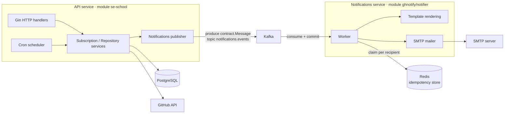
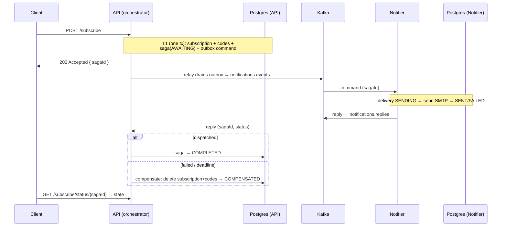
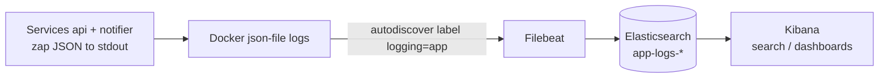
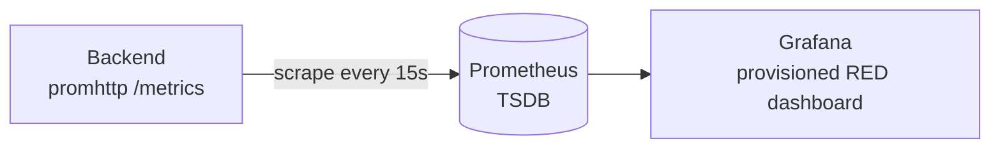
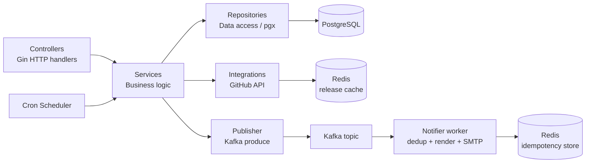

# GitHub Release Notification API

## Project Overview

A Go REST API that lets users subscribe to email notifications about new releases of any public GitHub repository. 
When a tracked repository publishes a new release, every confirmed subscriber receives an email with the update details.

The app is hosted at AWS: [frontend](http://51.20.10.168:4173/),
[backend](http://51.20.10.168:8080/swagger/index.html#/),
(api key is `test-api-key`).

**Core workflow:**

1. A user subscribes by providing their email and a GitHub repository (`owner/repo`).
2. The system validates the repository via the GitHub API, then runs an **orchestrated saga** that atomically persists the subscription and dispatches the confirmation email across the notifications service (see [Distributed transaction](#distributed-transaction-orchestrated-saga)). `POST /subscribe` returns `202 Accepted` with a saga id the client polls via `GET /subscribe/status/{sagaId}`.
3. The user confirms the subscription by following the link in the email.
4. A cron job periodically polls the GitHub API for new releases (responses are cached in Redis to cut API calls and respect rate limits); when a new tag is detected, all confirmed subscribers are notified via email.
5. Users can unsubscribe at any time using a token included in every notification email.

---

## Architecture

The system is split into **two independently deployable microservices** plus a shared
contract module. Email delivery — the notifications domain — has been extracted out of the
API into its own service. The two communicate asynchronously over a **Kafka topic**;
they share no database and make no in-process calls, only the wire types in `pkg/contract`.



- **API service** (`services/api`, Go module `se-school`): the HTTP API, the release-check
  cron, the database and the GitHub integration. When it needs to send an email it **produces**
  a `contract.Message` (template name + receivers + payload + idempotency key) to Kafka instead
  of sending it.
- **Notifications service** (`services/notifications`, Go module `ghnotify/notifier`):
  consumes the topic, renders the HTML template (embedded in the binary) and delivers the email
  over SMTP. It deduplicates per recipient (Redis) so each email is sent **at most once**. It
  owns a small PostgreSQL database (`deliveries`) that records each dispatch outcome — its
  durable participant state in the Subscribe saga (see below).
- **Contract** (`pkg/contract`, Go module `ghnotify/contract`): the pure, JSON-serializable
  types both sides agree on (topic names, template names, payloads and the idempotency-key helper).

> **Delivery semantics:** Kafka gives durable, acknowledged, at-least-once delivery (manual offset
> commit). Because at-least-once can redeliver, the consumer claims a per-recipient idempotency
> marker in Redis before sending — so every email goes out **at most once** even on redelivery or
> re-publish. Messages that fail terminally or exhaust their retries are routed to a dead-letter
> topic (`notifications.events.dlq`).

### Distributed transaction (orchestrated saga)

The **Subscribe** flow is a distributed transaction across the two services'
**separate databases**, coordinated by an **orchestrated saga** (no 2PC). Its
invariant: *a subscription is durable (awaiting the user's confirm click) **iff**
its confirmation email was dispatched; otherwise it is compensated away.* See
[ADR-005](services/api/docs/adrs/ADR-005-orchestrated-saga-decision.md).



- **Transactional outbox.** The confirmation-email command is written in the *same*
  transaction as the subscription (an `outbox` row), and a background **relay**
  publishes it — so "state changed" and "command emitted" are atomic (the previous
  create-then-publish dual-write is gone).
- **Reply channel.** The notifier reports each dispatch outcome on
  `notifications.replies`; the API's reply consumer completes or compensates the saga.
- **Durability.** The `saga_instances` state machine is the source of truth; a
  **deadline sweeper** compensates sagas whose reply never arrives (notifier down /
  reply lost), so nothing is stranded. Everything is idempotent (content-derived
  idempotency key + Redis dedup + the `deliveries` unique constraint), so re-drives
  and duplicate replies are safe.

**Key technologies:**

| Concern | Technology |
|---|---|
| Language | Go 1.26 |
| HTTP framework | [Gin](https://github.com/gin-gonic/gin) |
| Database driver | [pgx v5](https://github.com/jackc/pgx) + [pgxpool](https://pkg.go.dev/github.com/jackc/pgx/v5/pgxpool) on PostgreSQL 16 |
| Cache / NoSQL store | [redis/go-redis v9](https://github.com/redis/go-redis) on Redis 7 (GitHub release-lookup cache + notifier idempotency store) |
| Schema migrations | [golang-migrate](https://github.com/golang-migrate/migrate) (embedded SQL, run on startup) |
| GitHub client | [go-github v84](https://github.com/google/go-github) |
| Email delivery | SMTP via [gomail](https://github.com/go-gomail/gomail) (in the notifications service) |
| Inter-service messaging | Apache Kafka via [segmentio/kafka-go](https://github.com/segmentio/kafka-go) (durable, at-least-once + consumer-side dedup) |
| Cron scheduler | [robfig/cron](https://github.com/robfig/cron) |
| Configuration | [Viper](https://github.com/spf13/viper) + [godotenv](https://github.com/joho/godotenv) |
| Logging | [zap](https://go.uber.org/zap) (structured JSON, shipped via Filebeat → Elasticsearch → Kibana) |
| Metrics | [Prometheus client_golang](https://github.com/prometheus/client_golang) + Grafana (RED dashboard) |
| API docs | [Swagger / swag](https://github.com/swaggo/swag) |
| Linting | [golangci-lint](https://golangci-lint.run) |
| Git hooks | [Lefthook](https://github.com/evilmartians/lefthook) |
| Containerisation | Docker multi-stage build + Docker Compose |

---

## How to Run

### Prerequisites

- **Go ≥ 1.26**
- **PostgreSQL 16** (or use the Docker Compose setup)
- **Redis 7** (or use the Docker Compose setup)
- **Docker & Docker Compose** (for the containerised path)
- A **GitHub personal access token** (classic, with `public_repo` scope is enough)
- SMTP credentials for sending emails (e.g. Gmail App Password, Mailtrap, etc.)

### Environment variables

Copy the example file and fill in real values:

```bash
cp .env.example .env
```

**Backend (read by the Go app):**

| Variable | Description |
|---|---|
| `DB_DSN` | PostgreSQL connection string |
| `SERVER_PORT` | HTTP port the server listens on (default `8080`) |
| `SERVER_API_KEY` | Static API key for the `X-API-Key` header (leave empty to disable auth) |
| `GITHUB_TOKEN` | GitHub personal access token |
| `MAILER_HOST` | SMTP host |
| `MAILER_PORT` | SMTP port (e.g. `587`) |
| `MAILER_USERNAME` | SMTP username |
| `MAILER_FROM` | Sender email address |
| `MAILER_SMTP` | SMTP server address |
| `MAILER_PASSWORD` | SMTP password |
| `REDIS_ADDRESS` | Redis `host:port` for the GitHub release cache (default `redis:6379`) |
| `REDIS_PASSWORD` | Redis password (leave empty if unset) |
| `REDIS_DB` | Redis logical database number (default `0`) |
| `CRON_REPO_CHECK_SCHEDULE` | Cron expression for release polling (default `0 * * * *` — every hour) |
| `FRONTEND_URL` | Base URL used to build confirmation / unsubscribe links in emails |

> The `LOG_*` variables are documented under [Structured Logging & Log Pipeline → Configuration](#configuration).

> **Saga / messaging:** the API also reads `KAFKA_BROKERS`, `KAFKA_TOPIC`, `KAFKA_DLQ_TOPIC` and
> `KAFKA_REPLIES_TOPIC` (the saga reply channel), plus optional `SAGA_DEADLINE`,
> `SAGA_RELAY_INTERVAL` and `SAGA_SWEEP_INTERVAL` (sensible defaults). The **notifications
> service** now has its **own** `DB_DSN` pointing at a separate database (its `deliveries` store);
> in Docker Compose this is the `notifier-postgres` container / `NOTIFIER_POSTGRES_DB`.

**Postgres containers (used only by Docker Compose to initialise the databases — the apps connect via their own `DB_DSN`):**

| Variable | Description |
|---|---|
| `POSTGRES_USER` | Superuser created when the postgres containers first start |
| `POSTGRES_PASSWORD` | Superuser password |
| `POSTGRES_DB` | API database name created on first start (`gh-subscriptions`) |
| `NOTIFIER_POSTGRES_DB` | Notifications-service database name (`gh-notifier`) for the `notifier-postgres` container |

### Run locally

The two services are separate Go modules. Each runs from its own module directory; both need a
running Kafka broker (the API produces, the notifier consumes) plus Redis (GitHub cache and the
notifier's idempotency store).

```bash
# 1. Install dependencies for every module
make dependencies        # go mod tidy && go mod download per module

# 2. Make sure PostgreSQL, Kafka and Redis are running, and that DB_DSN,
#    KAFKA_BROKERS and REDIS_ADDRESS in .env point to them

# 3. Start the API (HTTP + cron + Kafka producer)
cd services/api && go run ./cmd

# 4. In another terminal, start the notifications service (Kafka consumer + SMTP)
cd services/notifications && go run ./cmd
```

The API starts on the port defined by `SERVER_PORT` (default `8080`).
Swagger UI is available at `http://localhost:8080/swagger/index.html`.

### Run with Docker Compose

A single compose file brings up the whole cluster:

```bash
# Build and start kafka + redis + postgres + api + notifier
docker compose up --build
```

This will:
- Start **Kafka** (KRaft), **Redis 7** and **PostgreSQL 16** containers with health-checks.
- Build and start the **api** service (HTTP API + cron + Kafka producer), exposed on `SERVER_PORT`.
- Build and start the **notifier** service (Kafka consumer + SMTP sender).

To stop:

```bash
docker compose down
```

### Useful Makefile targets

| Target | Description |
|---|---|
| `make dependencies` | `go mod tidy` + `go mod download` for every module |
| `make lint` | Run `golangci-lint` per module (auto-installs if missing) |
| `make swagger` | Regenerate Swagger docs into `services/api/docs/generated/` |
| `make test-unit` | Run unit tests with the race detector across all modules |
| `make test-integration` | Spin up `docker-compose.test.yml` (Postgres + Redis + runner) and run the integration suite (`make test-integration-down` to clean up) |
| `make test-e2e` | Spin up `docker-compose.e2e.yml` (full stack + frontend + Mailpit) and run the end-to-end suite (`make test-e2e-down` to clean up) |
| `make up` | Start the whole stack: api + notifier + Postgres + Redis + logging (ES/Kibana/Filebeat) + metrics (Prometheus/Grafana) |
| `make down` | Stop the stack (append `-v` manually to also drop the ES/TSDB/db volumes) |
| `make logs` | Follow logs (`make logs SVC="prometheus grafana"` to scope) |

### Git hooks (Lefthook)

Pre-commit hooks run **linting** and **Swagger docs regeneration** in parallel. Install with:

```bash
go run github.com/evilmartians/lefthook/v2 install
```

---

## Structured Logging & Log Pipeline (Elasticsearch + Kibana)

The service emits **structured JSON logs** (via [zap](https://go.uber.org/zap)) and ships
them through a local **Filebeat → Elasticsearch → Kibana** pipeline for search and
aggregation.

> ⚠️ This stack is for **local development** only. A production Elasticsearch
> cluster should be provisioned through your DevOps/IT team.

### How it works



- The app writes one JSON object per line to **stdout** using
  [ECS](https://www.elastic.co/guide/en/ecs/current/index.html)-friendly field names
  (`@timestamp`, `log.level`, `message`, `service.name`, `http.request.method`, …).
- Every HTTP request is tagged with a correlation **`request_id`** (returned in the
  `X-Request-ID` response header and reusable on the way in) so related log lines can be
  traced together.
- Docker captures stdout via the `json-file` driver. **Filebeat** autodiscovers only the
  container labelled `logging: "app"`, decodes the JSON, and ships it to Elasticsearch
  under daily indices `app-logs-YYYY.MM.dd`.
- **Kibana** queries those indices for ad-hoc search (Discover) and dashboards.

### Configuration

| Variable | Default | Description |
|---|---|---|
| `LOG_LEVEL` | `info` | `debug` / `info` / `warn` / `error` |
| `LOG_ENCODING` | `json` | `json` for the pipeline, `console` for human-readable local dev |
| `LOG_ENVIRONMENT` | `development` | Tags every log with `service.environment` |
| `LOG_SERVICE_NAME` | `se-school` | Tags every log with `service.name` |
| `LOG_VERSION` | `dev` | Tags every log with `service.version` |

### Run the pipeline

```bash
# Brings up the whole stack (api + notifier + postgres + redis + ES/Kibana/Filebeat + Prometheus/Grafana)
make up

# Follow the logging components (optional)
make logs SVC="filebeat elasticsearch kibana"
```

Endpoints once it's up:

- Backend / Swagger: `http://localhost:8080/swagger/index.html`
- Elasticsearch: `http://localhost:9200`
- Kibana: `http://localhost:5601`

Generate some traffic so there are logs to look at:

```bash
curl -H "X-API-Key: $SERVER_API_KEY" "http://localhost:8080/api/subscriptions?email=test@example.com"
curl "http://localhost:8080/swagger/index.html"
```

Confirm logs reached Elasticsearch:

```bash
curl "http://localhost:9200/_cat/indices/app-logs-*?v"
curl "http://localhost:9200/app-logs-*/_search?size=1&pretty"
```

### Set up Kibana (one-time, manual)

1. Open **http://localhost:5601**.
2. Go to **Stack Management → Data Views → Create data view**.
   - **Name**: `app-logs`
   - **Index pattern**: `app-logs-*`
   - **Timestamp field**: `@timestamp`
   - Save.
3. Open **Discover**, pick the `app-logs-*` data view, and explore. Useful
   [KQL](https://www.elastic.co/guide/en/kibana/current/kuery-query.html) filters:
   - `log.level: "error"` — only errors
   - `http.response.status_code >= 400` — failing requests
   - `request_id: "<id>"` — every line for one request (copy the `X-Request-ID` header)
   - `service.name: "se-school" and message: "http request"` — access log
4. Build visualizations (**Dashboard → Create → Create visualization**), e.g.:
   - **Log volume by level**: a bar chart over `@timestamp` split by `log.level`.
   - **Top errors**: a data table of `message` filtered to `log.level: "error"`.
   - **Request latency**: average/percentile of `event.duration` (milliseconds) over time.
   - **Slowest endpoints**: `event.duration` aggregated by `url.path`.
   Save them to a dashboard.

### Tear down

```bash
make down          # keep volumes
# or, to also delete indexed logs / metrics / db data:
docker compose down -v
```

> On Linux, Elasticsearch may require a higher `vm.max_map_count`:
> `sudo sysctl -w vm.max_map_count=262144`. Docker Desktop (macOS/Windows) handles this
> automatically.

---

## Metrics & RED Pipeline (Prometheus + Grafana)

The service is instrumented with **[RED](https://grafana.com/blog/2018/08/02/the-red-method-how-to-instrument-your-services/)
metrics** (Rate, Errors, Duration) exposed in Prometheus format at **`/metrics`**, and ships
them through a local **Prometheus → Grafana** pipeline for scraping and visualization.

> ⚠️ This stack is for **local development** only. Production Prometheus/Grafana should be
> provisioned through your DevOps/IT team.

### How it works



- An HTTP middleware (`PrometheusMiddleware`) records every request; the **cron worker** records
  each run and per-repository check. Metrics live under the `se_school` namespace
  (`internal/metrics/metrics.go`).
- **Prometheus** scrapes the backend's `/metrics` endpoint (config: `deploy/metrics/prometheus.yml`).
- **Grafana** auto-provisions the Prometheus datasource and a **RED dashboard**
  (`deploy/metrics/grafana/`) — no manual setup needed.

### What's measured

| Signal | HTTP | Cron worker |
|---|---|---|
| **Rate** | `se_school_http_requests_total` | `se_school_cron_job_runs_total`, `se_school_repo_check_total` |
| **Errors** | same, by `status` label (`4xx`/`5xx`) | same, by `status` label (`success`/`error`) |
| **Duration** | `se_school_http_request_duration_seconds` | `se_school_cron_job_duration_seconds` |

`se_school_http_requests_in_flight` (gauge) additionally tracks concurrent requests.

### Run the pipeline

```bash
# Same single stack — metrics come up with everything else
make up

# Follow the metrics components (optional)
make logs SVC="prometheus grafana"
```

Endpoints once it's up:

- Backend / raw metrics: `http://localhost:8080/metrics`
- Prometheus: `http://localhost:9090` (check **Status → Targets**: `se-school` should be `UP`)
- Grafana: `http://localhost:3000` (login `admin` / `admin`; anonymous viewing is enabled)

Generate some traffic, then confirm the series exist:

```bash
curl "http://localhost:8080/swagger/index.html"
curl -s "http://localhost:8080/metrics" | grep se_school_
```

Open Grafana → the **se-school RED** dashboard for rate / error / latency panels (HTTP + cron).

### Tear down

```bash
make down          # keep volumes
# or, to also delete stored metrics / logs / db data:
docker compose down -v
```

---

## Testing

The project has three test tiers:

| Tier | Location | Runs against | Command |
|---|---|---|---|
| **Unit** | `internal/**/*_test.go` | Pure Go, mocked dependencies | `make test-unit` |
| **Integration** | `tests/integration/` | Ephemeral Postgres + Redis, GitHub API mocked in-process | `make test-integration` |
| **End-to-end** | `tests/e2e/` | Full stack via Docker Compose: backend, frontend, Postgres, Redis, [Mailpit](https://github.com/axllent/mailpit) | `make test-e2e` |

- **Unit** tests run with the race detector across `./internal/...`.
- **Integration** tests (`docker-compose.test.yml`) boot throwaway `postgres:16.3` and
  `redis:7` containers (tmpfs, no volumes) plus a test runner (`Dockerfile.test`, env from
  `.env.test`). The GitHub API is stubbed by a local mock (`tests/integration/helpers/mswgh.go`);
  shared bootstrap and fixtures live in `tests/integration/helpers/`.
- **End-to-end** tests (`docker-compose.e2e.yml`, env from a local `.env.e2e`) bring up the
  real backend, the Vite frontend, Postgres, Redis, and Mailpit, then drive the full flow
  (subscribe → confirm → list → unsubscribe) and assert captured emails via Mailpit. The
  release-check cron is parked on a far-future schedule so it doesn't fire mid-run. This suite
  is its own Go module (`tests/e2e/go.mod`).

The `*-down` targets (`make test-integration-down`, `make test-e2e-down`) tear down the
corresponding stack and drop its volumes.

---

## Project Structure

```
.
├── pkg/
│   └── contract/                        # Shared module: ghnotify/contract
│       ├── contract.go                  # Topics, TemplateName, Message + Reply envelopes, payloads, idempotency key
│       └── go.mod
├── services/
│   ├── api/                             # API service · Go module se-school
│   │   ├── cmd/main.go                  # Entry-point: HTTP + cron + publisher wiring
│   │   ├── docs/                        # Swagger (source spec + generated)
│   │   ├── internal/
│   │   │   ├── config/                  # Configuration structs & .env loader (Viper)
│   │   │   ├── controllers/             # HTTP handlers (Gin), middlewares & routing
│   │   │   ├── cron/                    # Cron scheduler (robfig/cron)
│   │   │   ├── infrastructure/          # db (pgxpool + migrations), logging, redis, kafka
│   │   │   ├── integrations/github/     # GitHub API client (go-github)
│   │   │   ├── metrics/                 # Prometheus RED metric definitions (metrics.go)
│   │   │   ├── models/                  # Domain models & DTOs
│   │   │   ├── notifications/           # Publisher + payload builders + saga transport
│   │   │   │   ├── publisher/           # Kafka publisher (cron fire-and-forget path)
│   │   │   │   ├── relay/               # Transactional-outbox relay (drains outbox → Kafka)
│   │   │   │   └── replies/             # Saga reply consumer (drives the orchestrator)
│   │   │   ├── repositories/            # Data-access layer (pgx); incl. saga/ + outbox/
│   │   │   ├── services/                # Business logic (subscription orchestrator, repository)
│   │   │   ├── uow/                     # Unit of work: atomic multi-repo saga transaction (T1)
│   │   │   └── utils/                   # Shared helpers (e.g. code generation)
│   │   ├── tests/integration/           # Integration tests (postgres + redis; saga replies driven directly)
│   │   ├── Dockerfile
│   │   └── go.mod / go.sum
│   └── notifications/                   # Notifications service · Go module ghnotify/notifier
│       ├── cmd/main.go                  # Entry-point: consume + render + send
│       ├── internal/
│       │   ├── config/                  # Slim config (Kafka, Redis, Mailer, DB, Log)
│       │   ├── dedup/                   # Idempotency store (Redis SET NX) — at-most-once
│       │   ├── infrastructure/db/       # Own Postgres (pgxpool + deliveries migration)
│       │   ├── infrastructure/kafka/    # Consumer (reader) + DLQ + saga reply producer
│       │   ├── logging/                 # Structured zap logger
│       │   ├── mailer/                  # Low-level SMTP sending (gomail)
│       │   ├── repositories/delivery/   # Delivery records — saga participant state
│       │   ├── templates/               # HTML templates & rendering (htmls/ embedded)
│       │   └── worker/                  # Consumer loop (decode → render → send → record → reply, ack/retry/DLQ)
│       ├── Dockerfile
│       └── go.mod / go.sum
├── tests/e2e/                           # Black-box e2e tests (own module)
├── deploy/
│   ├── logging/filebeat.yml             # Filebeat autodiscover + Elasticsearch output
│   └── metrics/                         # Prometheus scrape config + provisioned Grafana RED dashboard
├── .env.example                         # Environment variable template (shared by both services)
├── docker-compose.yml                   # Single cluster: kafka + redis + postgres + api + notifier + logging + metrics
├── docker-compose.e2e.yml               # End-to-end test stack
├── docker-compose.test.yml              # Integration test stack
├── Dockerfile.test                      # Integration test runner image
├── Makefile                             # Build / lint / swagger / test targets
└── README.md
```

Each service follows a **layered architecture** internally, communicating through **Go
interfaces** so dependencies are trivially mockable in tests:



---

## API Overview

All endpoints are served under the `/api` base path and require the `X-API-Key` header (unless `SERVER_API_KEY` is left empty).

Interactive Swagger UI is available at **`/swagger/index.html`** when the server is running.

## Future improvements

1. ~~Add a transactional outbox so duplicate publishes are eliminated at the source.~~
   **Done** — the Subscribe flow now uses a transactional outbox + relay and an orchestrated
   saga (see [Distributed transaction](#distributed-transaction-orchestrated-saga) /
   [ADR-005](services/api/docs/adrs/ADR-005-orchestrated-saga-decision.md)). Next: extend the
   same outbox to the cron release-notification path, which still publishes inline.
2. Consolidate the notifier's two idempotency mechanisms — retire the Redis dedup marker in
   favour of the `deliveries` unique constraint for saga messages.
3. Add tooling to inspect and replay the dead-letter topic (`notifications.events.dlq`) and the saga replies.
4. Move the API's in-order background loops (relay, reply consumer, sweeper) behind a leader
   election so more than one API instance can run safely.
5. Wire the unit / integration / e2e suites into CI to run on every push.
