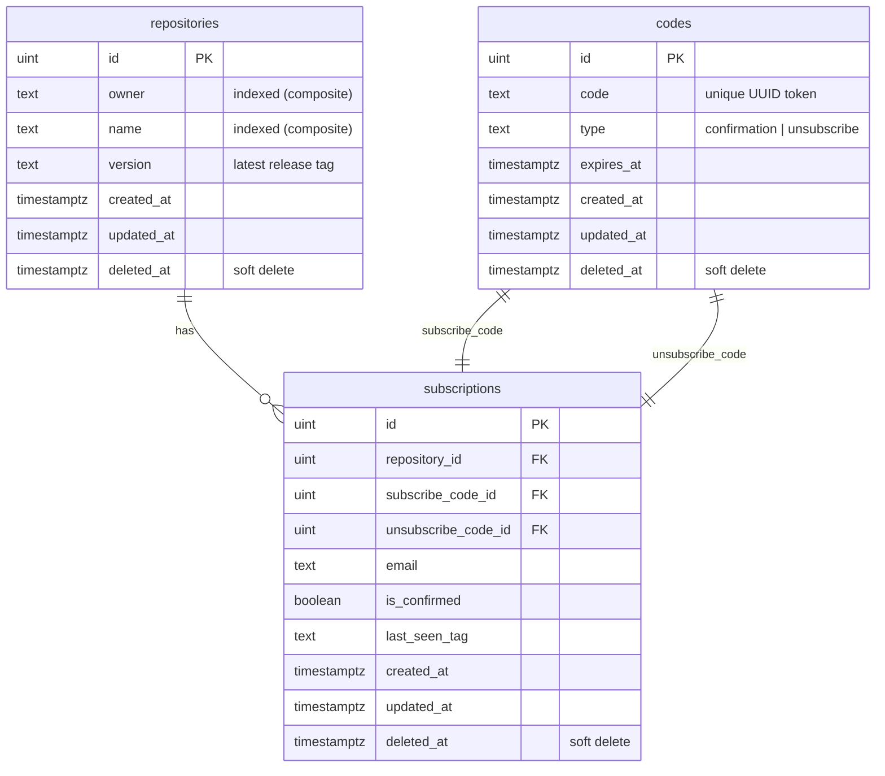

# ADR-001 Database chose decision
* Status: accepted
* Date: 2026-05-09
* Author: Ivan Markhaichuk

## Context
We have to choose the database to store:
* Information on users and their subscriptions
* GitHub repositories statuses
* User's subscriptions state

---

## Considered technologies
1. PostgreSQL
   1. Pros: simplicity and reliability of relational databases, ACID transactions support, JSON support
   2. Cons: migrations handling - harder to change database structure, pivot
2. MongoDB:
   1. Pros: ease of database structure modification and scaling in the future
   2. Cons: Limited Transactions and Data Integrity, High Index Dependence

---

## Chosen database: `PostgreSQL`

### Database schema

**Notes:**
- `gorm.Model` embeds `id`, `created_at`, `updated_at`, `deleted_at` in every table — all deletes are soft deletes.
- `repositories` has a composite index on `(owner, name)`.
- `subscriptions` has a partial unique index on `(email, repository_id) WHERE deleted_at IS NULL`, allowing re-subscription after unsubscribe.
- Deleting a `subscription` triggers an `AfterDelete` hook that cascade-soft-deletes both linked `codes`.

## Consequences
### Positive
* Reliability and data consistency
* Great queries and transactions possibilities
### Negative
* The need to handle database migrations
