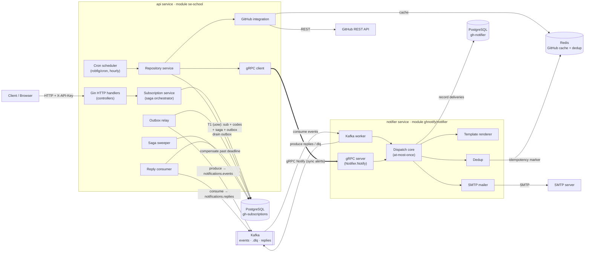
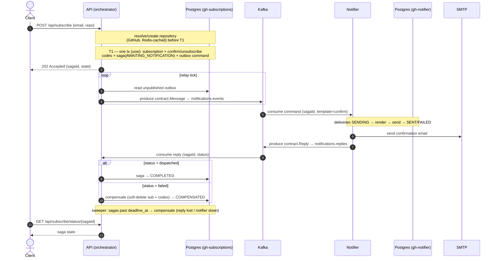
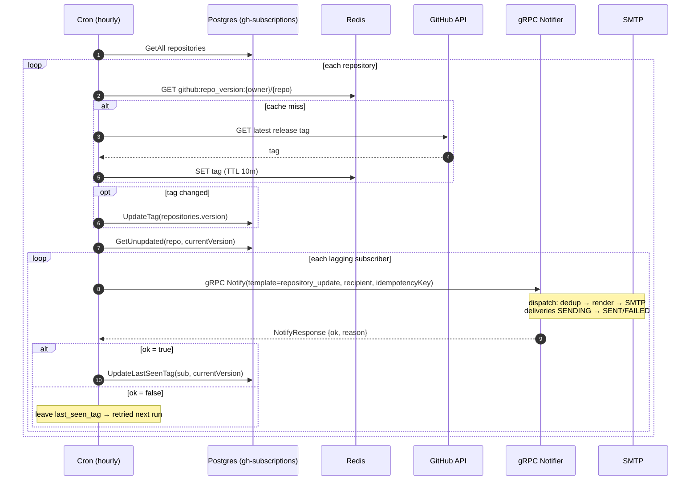
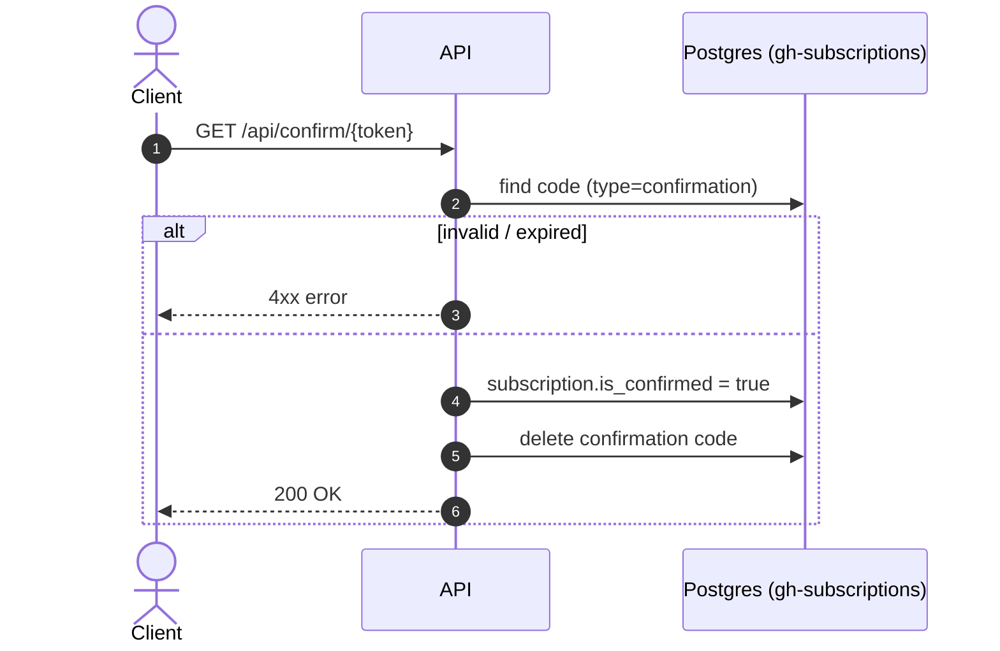
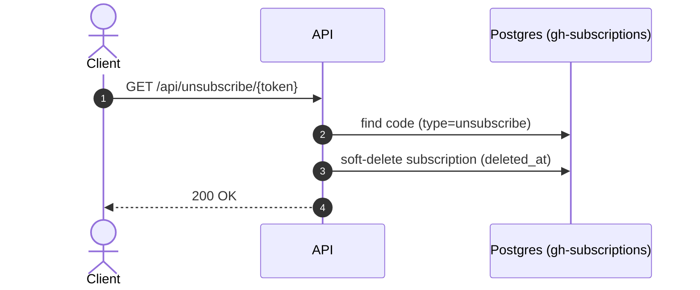

# Application Architecture

UML views of the **GitHub Release Notification** system, rendered in Mermaid so they
display inline on GitHub. This document reflects the **current code**; where the older
`services/api/docs/system-design.md` diverges (e.g. it shows release alerts over Kafka),
this file is the source of truth.

The system lets a user subscribe (by email) to a public GitHub repository and receive an
email when that repo publishes a new release. It is split into **two independently
deployable Go microservices** plus a shared wire-contract module:

- **`api`** (`services/api`, module `se-school`) — Gin HTTP API + hourly release-poll cron
  + the orchestrator of the subscribe **saga**.
- **`notifier`** (`services/notifications`, module `ghnotify/notifier`) — email delivery
  over **two transports** (a Kafka consumer and a gRPC server) that share one at-most-once
  dispatch core.
- **`pkg/contract`** (module `ghnotify/contract`) — the pure wire types both sides agree on
  (Kafka envelopes + the gRPC `.proto`).

The two services **share no database**. They talk over two transports:

- **Kafka (async)** — the subscribe/confirmation **saga**: outbox → relay → worker →
  replies → sweeper.
- **gRPC (sync)** — repository-update **alerts**: the cron calls `Notifier.Notify` once per
  subscriber and only advances that subscriber's `last_seen_tag` when the call returns
  `ok = true`.

---

## 1. Component / Container view

Structural view (C4-container style): the two services, their internal components, the
infrastructure they depend on, and the protocol on every connector.

| Component | Role |
|---|---|
| **Gin HTTP handlers** | Serve `/api/*` (subscribe, status, confirm, unsubscribe, list); X-API-Key auth, request-id, logging, metrics middleware. |
| **Subscription service** | Orchestrates the subscribe saga; the `uow` atomic write (T1) and the `HandleReply` / `Sweep` state transitions. |
| **Repository service** | Cron target: polls GitHub for new tags and fans out release alerts over the gRPC client. |
| **Cron scheduler** | Fires `CheckAllReposTagAndAlert` on `CRON_REPO_CHECK_SCHEDULE` (default hourly). |
| **Outbox relay / Reply consumer / Saga sweeper** | Background loops: drain the outbox → Kafka; consume saga replies; compensate sagas whose reply never arrives before `deadline_at`. |
| **GitHub integration** | `go-github` client; latest-release lookups cached in Redis (10 min TTL). |
| **gRPC client → gRPC server** | Synchronous `Notifier.Notify` path for repository-update alerts (`notifier:9090`). |
| **Kafka worker** | Consumes `notifications.events` (saga commands), publishes replies / dead-letters. |
| **Dispatch core** | Shared at-most-once delivery: claim `deliveries` row → dedup → render → SMTP with retry; `SENDING → SENT/FAILED`. |
| **PostgreSQL ×2** | `gh-subscriptions` (API: repositories, subscriptions, codes, saga_instances, outbox) and `gh-notifier` (notifier: deliveries). No shared DB. |
| **Redis** | Dual use: GitHub release-lookup cache (API) **and** per-recipient idempotency store (notifier). |
| **Kafka** | Durable transport: `notifications.events`, `notifications.events.dlq`, `notifications.replies`. |

---

## 2. Behavioral views (sequence diagrams)

### 2a. Subscribe — orchestrated saga (async, Kafka)

Distributed transaction across the two databases. Invariant: a subscription is durable
(awaiting the confirm click) **iff** its confirmation email was dispatched; otherwise it is
compensated away.

### 2b. Release poll & alert — cron → synchronous gRPC

The hourly cron detects new release tags and notifies lagging subscribers one at a time over
gRPC. `last_seen_tag` advances **only** on a confirmed (`ok=true`) delivery, so a failed
recipient is retried next run without blocking the others.

### 2c. Confirm subscription

### 2d. Unsubscribe

---

## References (source of truth in code)

| Concern | File(s) |
|---|---|
| gRPC contract (`Notifier.Notify`, `NotifyRequest/Response`) | `pkg/contract/notifierpb/notifier.proto` |
| Kafka wire types, topics, template names | `pkg/contract/contract.go` |
| gRPC server / client | `services/notifications/internal/grpcserver/server.go`, `services/api/internal/notifications/grpcclient/` |
| Cron alert path (sync gRPC, `ok`-gated tag advance) | `services/api/internal/services/repository/update.go` |
| Saga orchestrator (outbox, relay, replies, sweeper, uow) | `services/api/internal/services/subscription/saga.go`, `services/api/internal/notifications/{relay,replies}/`, `services/api/internal/uow/uow.go` |
| Delivery core (at-most-once) | `services/notifications/internal/dispatch/dispatch.go` |
| HTTP routes | `services/api/internal/controllers/router.go` |
| Service entrypoints | `services/api/cmd/main.go`, `services/notifications/cmd/main.go` |
| Saga decision record | `services/api/docs/adrs/ADR-005-orchestrated-saga-decision.md` |
