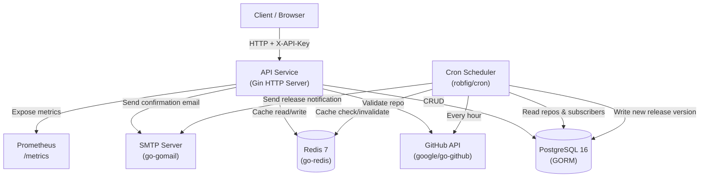
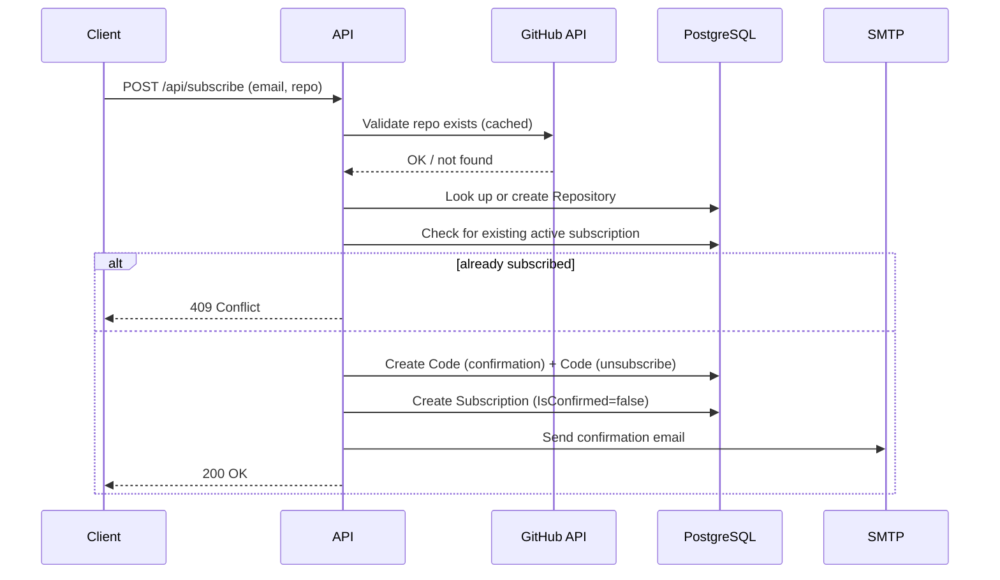
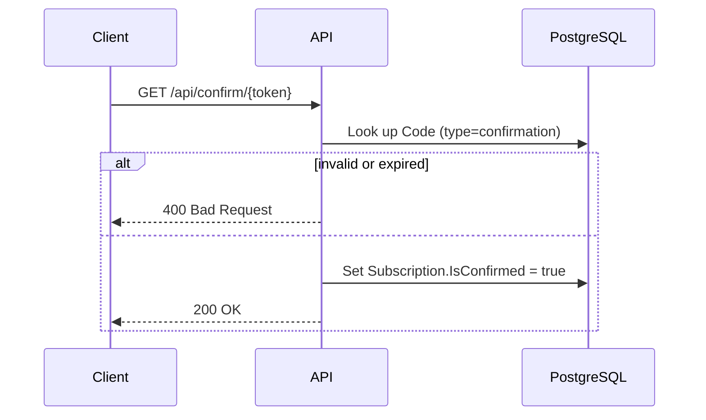
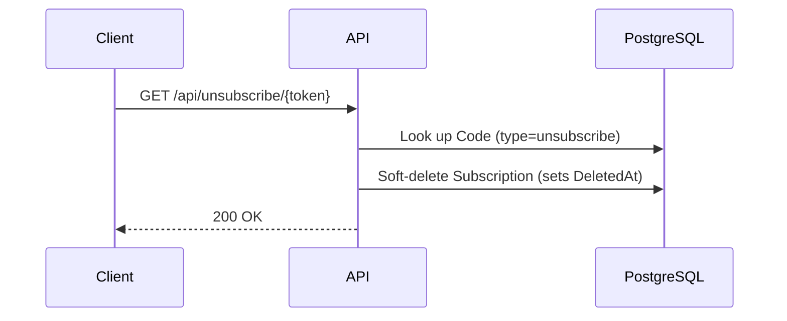
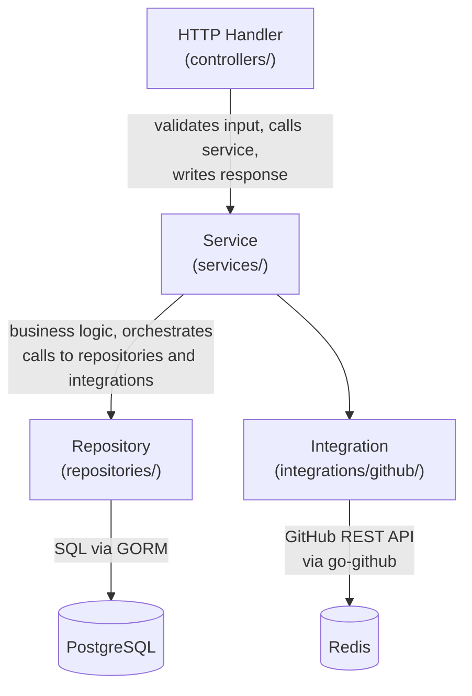
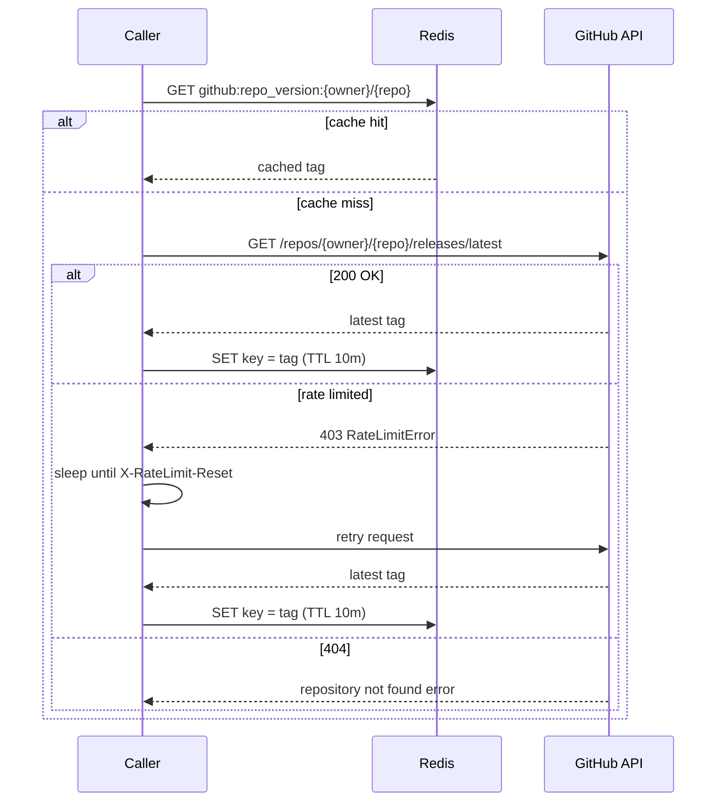
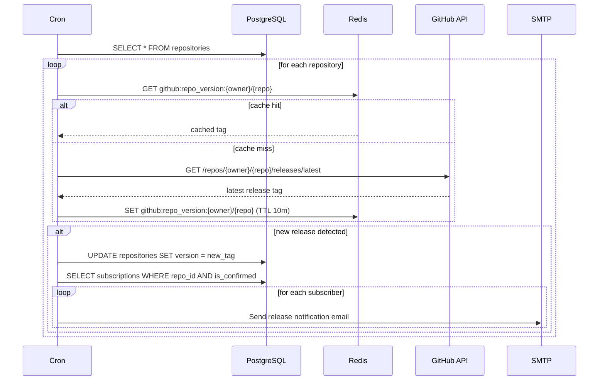

# System Design: GitHub Release Notification Service

## 1. System Requirements

### a. Functional Requirements

1. **Subscribe** — Users provide an email address and a GitHub repository (`owner/repo`) to subscribe to release notifications.
2. **Email Confirmation** — Upon subscription, the system sends a confirmation email with a unique one-time token; the subscription becomes active only after the user clicks the confirmation link.
3. **Release Polling** — The system periodically queries the GitHub API to detect new releases for every tracked repository.
4. **Release Notifications** — When a new release is detected, the system sends an email notification to all confirmed subscribers of that repository.
5. **Unsubscribe** — Each notification email contains a unique unsubscribe link; clicking it immediately deactivates the subscription without requiring authentication.
6. **List Subscriptions** — Users can retrieve all active subscriptions associated with their email address.
7. **Repository Validation** — Before creating a subscription, the system validates that the requested GitHub repository exists and is accessible.
8. **API Key Authentication** — All API endpoints are protected by a static API key passed via the `X-API-Key` header.

### b. Non-Functional Requirements

1. **Availability** — 99.5% uptime (single-instance deployment).
2. **Latency** — API responses under 500 ms for subscribe/confirm/unsubscribe; GitHub polling may take longer.
3. **Scalability** — Supports thousands of repositories and tens of thousands of subscribers.
4. **Reliability** — No lost notifications — all errors are logged; failed jobs do not block subsequent runs.
5. **Security** — API key authentication; tokens are unique and non-guessable (UUID v4); soft-delete prevents data loss.
6. **Observability** — Prometheus metrics for HTTP requests (count, latency, in-flight); structured logging via zap.
7. **Maintainability** — Clean layered architecture (handlers → services → repositories); interface-based design for testability.
8. **Documentation** — OpenAPI 2.0 (Swagger) spec; interactive UI at `/swagger/index.html`.
9. **Portability** — Fully containerized via Docker; single `docker-compose up` starts the entire stack.

### c. Constraints

1. **GitHub API Rate Limits** — Unauthenticated requests are limited to 60/hour; an authenticated personal access token raises this to 5,000/hour. The polling interval must be configured accordingly.
2. **SMTP Dependency** — Email delivery relies on a third-party SMTP server; no fallback mechanism is implemented.
3. **Single Instance** — The application runs as a single container with one cron worker; horizontal scaling is not supported without introducing distributed locking.
4. **Public Repositories Only** — The `public_repo` GitHub token scope gives access to public repositories only.
5. **Static API Key** — There is no user identity system or token rotation; the key is shared across all API consumers.
6. **No Retry Queue** — Failed email deliveries are logged but not retried automatically.

---

## 2. Load Estimation

### a. Users & Traffic

**Assumptions (moderate production load):**

| Metric | Estimate |
|---|---|
| Total registered users | 10,000 |
| Active subscriptions | 50,000 |
| Tracked repositories | 5,000 |
| New subscriptions per day | 500 |
| Subscription confirmations per day | 400 |
| Unsubscribes per day | 50 |
| `GET /subscriptions` queries per day | 1,000 |

**Derived HTTP request rates:**

| Endpoint | Requests/day | Requests/second (avg) |
|---|---|---|
| `POST /api/subscribe` | 500 | 0.006 |
| `GET /api/confirm/{token}` | 400 | 0.005 |
| `GET /api/unsubscribe/{token}` | 50 | 0.0006 |
| `GET /api/subscriptions` | 1,000 | 0.012 |
| **Total API** | **~1,950** | **~0.023** |

Traffic is very low on average; peak could be 10–50× higher (e.g. a popular repository publishes a release and triggers a burst of web traffic from newsletters).

**Cron job (hourly):**

- Polls 5,000 repositories × 1 GitHub API call = 5,000 calls/hour = ~1.4 calls/second against the GitHub API.
- With an authenticated token (5,000 req/hour limit), this is within limits.

### b. Data

**Per entity storage:**

| Entity | Size per row | Rows | Total |
|---|---|---|---|
| `repositories` | ~200 B | 5,000 | ~1 MB |
| `subscriptions` | ~300 B | 50,000 | ~15 MB |
| `codes` (confirmation + unsubscribe) | ~150 B | 100,000 | ~15 MB |
| **Total PostgreSQL** | | | **~31 MB** |

**Redis cache:**

- Cache key: `github:repo_version:{owner}/{repo}`, TTL 10 minutes
- ~5,000 keys × ~200 B = ~1 MB

Data volumes are small and will stay manageable for years without sharding.

**Growth projection (1 year at current rate):**

- +180,000 new subscriptions → ~54 MB additional
- PostgreSQL total after 1 year: ~85 MB — negligible

### c. Bandwidth

**Inbound (API requests):**

- Average request payload (subscribe form): ~100 B
- ~1,950 requests/day × 100 B = ~195 KB/day ≈ **< 1 MB/day inbound**

**Outbound (API responses):**

- Average response payload: ~500 B
- ~1,950 responses/day × 500 B ≈ **~1 MB/day outbound**

**Email notifications:**

- HTML email template size: ~5 KB
- Assuming 10 releases/day across all repos, avg 100 subscribers/repo
- 10 × 100 × 5 KB = **~5 MB/day via SMTP**

**GitHub API polling:**

- Response per release endpoint: ~2 KB
- 5,000 polls/hour × 24 h × 2 KB = **~240 MB/day outbound to GitHub**

Total bandwidth is dominated by GitHub API polling. Well within typical VPS or cloud egress limits.

---

## 3. High-Level Architecture



**Component roles:**

| Component | Role |
|---|---|
| **API Service** | Handles all HTTP traffic; validates input; orchestrates subscribe/confirm/unsubscribe flows |
| **Cron Scheduler** | Runs inside the same process; fires hourly to poll GitHub and send release notifications |
| **PostgreSQL** | Primary persistent store for repositories, subscriptions, and tokens |
| **Redis** | Short-lived cache (10 min TTL) for GitHub release versions to reduce API call volume |
| **GitHub API** | Source of truth for repository existence and latest release tags |
| **SMTP Server** | External email delivery for confirmation and notification emails |
| **Prometheus** | Scrapes `/metrics` for HTTP counters, histograms, and in-flight gauges |

---

## 4. Detailed Component Design

### a. API Service

**Framework:** Gin v1.12.0

**Startup sequence (`cmd/main.go`):**

1. Load configuration from `.env` / environment variables via Viper + godotenv.
2. Connect to PostgreSQL; run GORM auto-migrations for all models.
3. Connect to Redis.
4. Initialise Prometheus metric collectors.
5. Build dependency graph (repositories → services → controllers).
6. Register router with middleware stack.
7. Start cron scheduler.
8. Listen on `SERVER_PORT` (default `8080`).

**Route table:**

| Method | Path | Handler | Description |
|---|---|---|---|
| `POST` | `/api/subscribe` | `SubscriptionController.Subscribe` | Create pending subscription |
| `GET` | `/api/confirm/:token` | `SubscriptionController.Confirm` | Activate subscription |
| `GET` | `/api/unsubscribe/:token` | `SubscriptionController.Unsubscribe` | Delete subscription |
| `GET` | `/api/subscriptions` | `SubscriptionController.GetSubscriptions` | List by email |
| `GET` | `/swagger/*any` | Swagger UI handler | API documentation |
| `GET` | `/metrics` | Prometheus handler | Metrics scrape endpoint |

**Subscribe flow (`POST /api/subscribe`):**



**Confirm flow (`GET /api/confirm/:token`):**



**Unsubscribe flow (`GET /api/unsubscribe/:token`):**



**Error handling (`internal/controllers/errors.go`):**

Centralised mapping from domain errors to HTTP status codes. All errors are returned as JSON: `{"message": "..."}`.

**Layered architecture:**



**Prometheus metrics exposed:**

| Metric | Type | Labels |
|---|---|---|
| `se_school_http_requests_total` | Counter | `method`, `path`, `status_code` |
| `se_school_http_request_duration_seconds` | Histogram | `method`, `path` |
| `se_school_http_requests_in_flight` | Gauge | — |

---

### b. GitHub API Integration

**Library:** `google/go-github v84`

**Authentication:** Bearer token — GitHub personal access token (classic) with `public_repo` scope, configured via `GITHUB_TOKEN` environment variable.

**Key operation — `GetLatestRelease(ctx, owner, repo string) (string, error)`:**



**Caching strategy:**

- **Purpose:** Reduce GitHub API calls during the hourly cron run (5,000 repos × 1 call = potential rate limit exhaustion without caching).
- **TTL:** 10 minutes — balances freshness against API quota consumption.
- **Cache key pattern:** `github:repo_version:{owner}/{repo}` (string value = latest tag).
- **Invalidation:** TTL-based only; no explicit invalidation on write.

**Rate limit handling:**

- GitHub returns HTTP 403 with `X-RateLimit-Remaining: 0` and `X-RateLimit-Reset: <unix_timestamp>` when the rate limit is exhausted.
- The client detects this error type, calculates `sleep = resetTime - now`, waits, then retries the same call once.
- If the retry also fails (e.g. secondary rate limit), the error is propagated and logged.

**Cron job — `CheckAllReposTagAndAlert`:**

```
Schedule: CRON_REPO_CHECK_SCHEDULE (default: "0 * * * *" = hourly at :00)

For each Repository in database:
  1. Call GetLatestRelease(owner, repo)
  2. Compare returned tag with Repository.Version stored in DB
  3. If tags differ:
     a. Update Repository.Version in DB
     b. Fetch all confirmed Subscriptions for this repository
     c. For each Subscription:
          - Render HTML release notification template
          - Send email via SMTP mailer
          - Update Subscription.LastSeenTag
  4. Log any errors; continue to next repository
```

**Sequence diagram — cron notification flow:**



**Email templates:**

| Template | Trigger | Key payload |
|---|---|---|
| `confirmation.html` | New subscription created | Confirmation link with token |
| `repository_update.html` | New release detected | Repository name, release tag, unsubscribe link |

